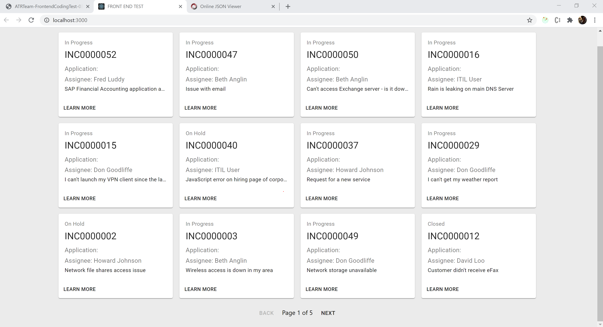
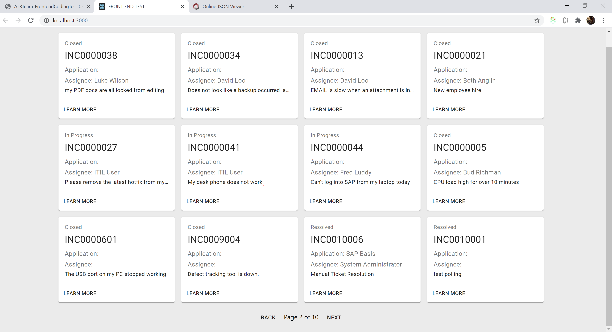
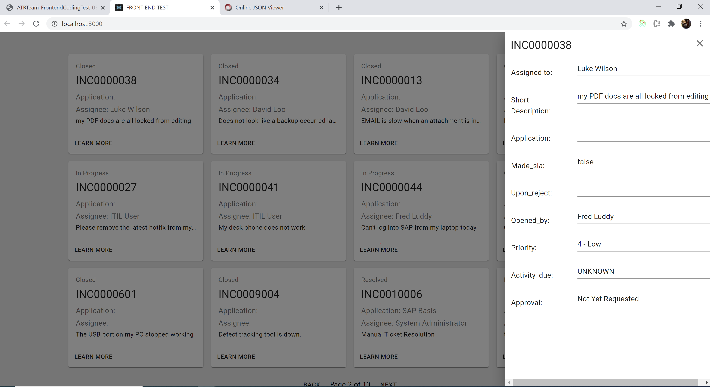
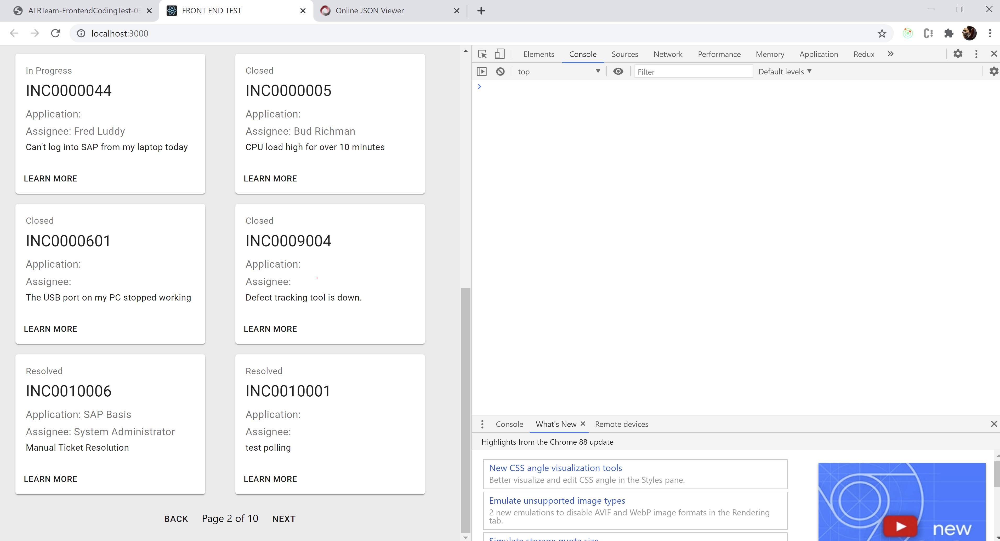
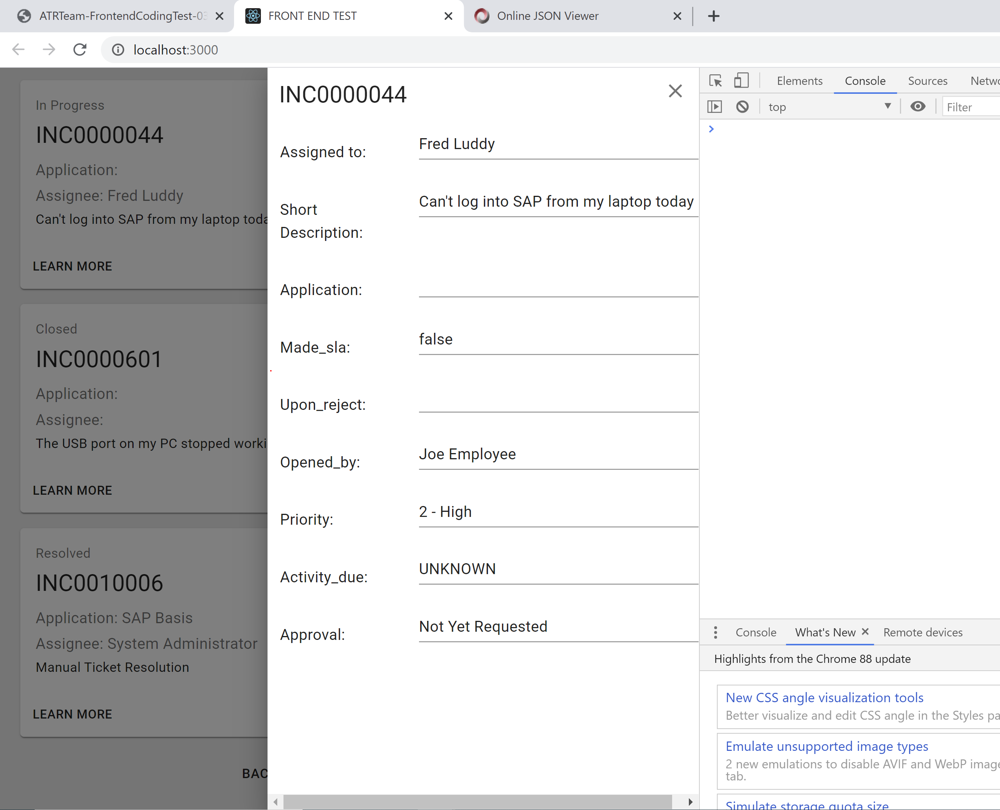
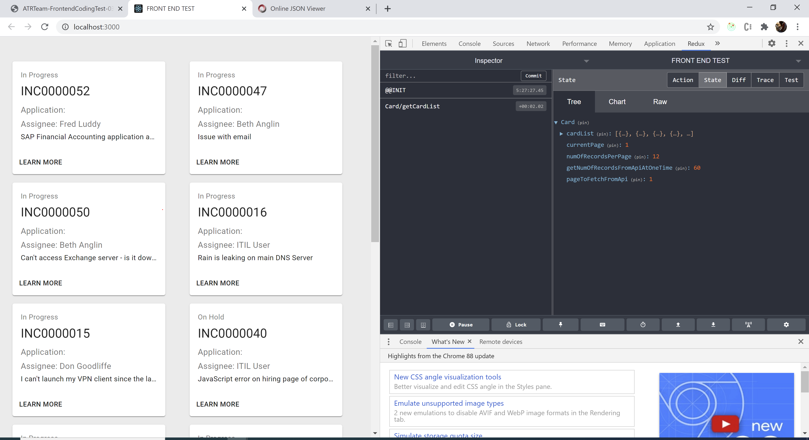
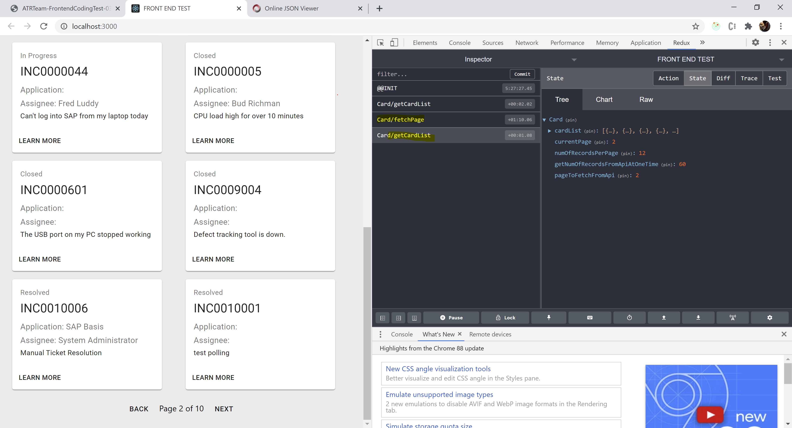
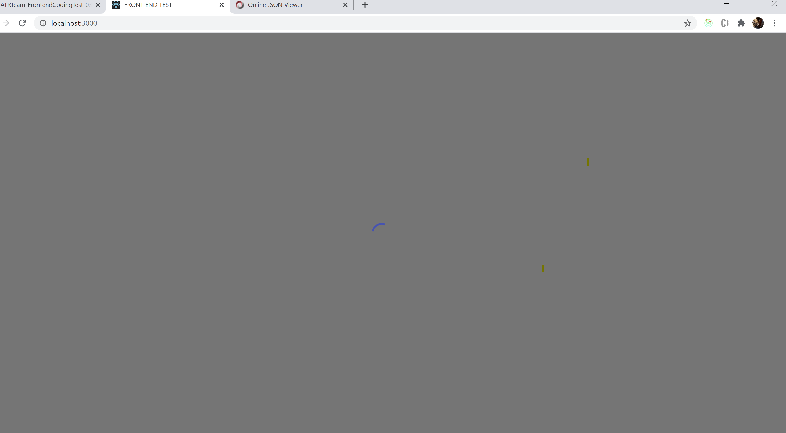

# Getting Started with Create React App

This project was bootstrapped with [Create React App](https://github.com/facebook/create-react-app).

## Steps to run this application on local machine.

1. Clone the repo from the url.
2. Go to the project folder and install all the dependency by running "npm install"
3. Start the API server by running the command in project folder using "node server.js".
   (NOTE: Initially I was facing some CORS issues while making API calls so to fix that I have to create a small node server which listen the API and send the response.)
4. Start the application using "npm run start" command
5. Open http://localhost:3000 in the browser to view the app.
6. Also for the Redux dev tools you can add dev tools extensions and add to the chrome.

### Note on API Side

As our first call is to get the auth token which needs to be passed in the API to fetch card data.
I am storing that token in local storage with using some encryption.For more info please have a look on Helpers.js file.

### Implementation of caching and fetching algo

# 1. I have useed redux state mangement to store the data.Currently its a small application but by the time may be the application volume will increase then this will help.

Below are the two actions:

1. getCardList: This action I am dispatching only when we are making apiCall to fetch the new set of card data (which is responsible to update the card data )
2. fetchPage : This action I am dispatching when user click on back and Next button

# 2. Below are the steps of algo for pagination implementation

1. On initial load I am fetching total 60 records from API.

2. After fetching the record from API, I am dividing those 60 records in 5 pages.

3. On UI, I am fetching the whole card list from the API and slicing the card list array according to the current page and total number of records e.g: If card list has 60 items and user's current page is 1 then on first page I will slice that array from cardList.slice(0,12). Same way if user is on page number 2 hence I will slice that array from cardList.slice(12,24).

4. I am making API call only when user is 3 pages behind last page e.g. initial pagination setup = Page 1 of 5, as soon as user reaches page#2 which is 3 pages behind the last page, I will make a API call and new state of pagination will be = page 2 of 10

## Running unit tests

Command to run the unit test is "npm run test".

## Visual highlights

# On Load:

# On Next page:

# On click on selected card:

# App in responsive:

# Redux state mangement:

# Spinner when user is waiting for any response if its already not available:

### Build time

Total time to make the build is 50-60s
